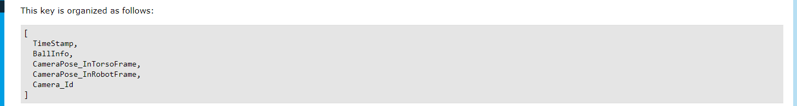
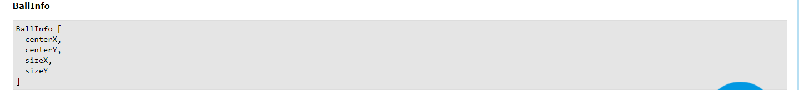
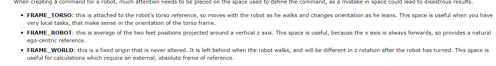
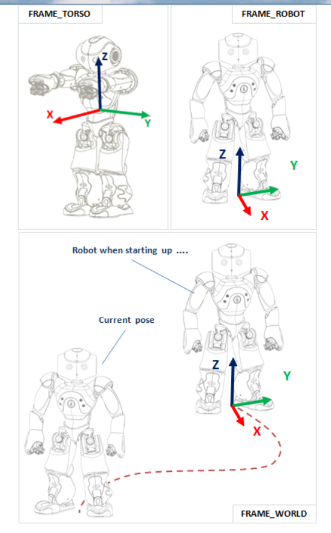
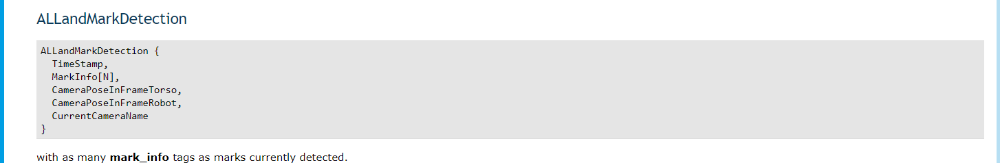
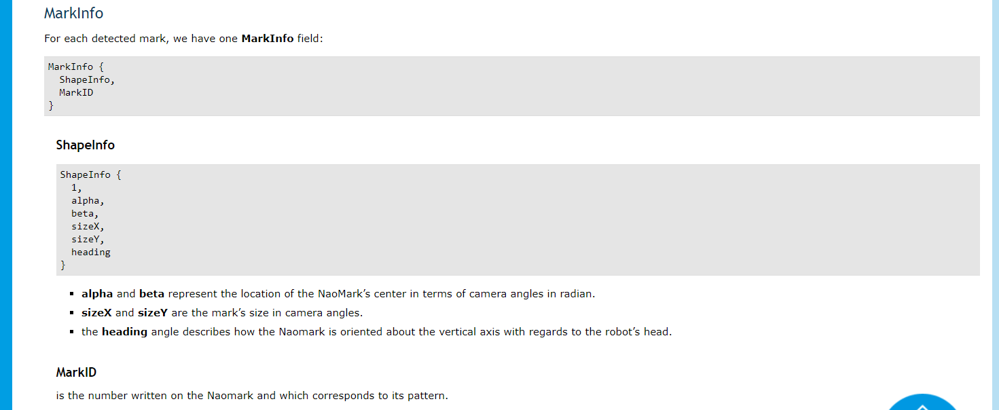

# NaoGolfCompetition

对于2019.12.7比赛的总结和未来的展望

## 机器人的运动模块

影响机器人击球方向和距离的因素主要有机器人击球动作的设计,高尔夫杆材质和地面摩擦力等因素

> 对于击球动作的设计,这里最好的方法采用nao自身携带的回读编程来实现.可以解除全身舵机然后摆到自己想要的动作,锁定舵机然后通过python代码读取全身舵机的角度即可实现击球的设计.但其中注意的是:
>
> 1. 在机器人摆到指定动作时是否会出现失去平衡的现象,如果设计不好在走路机器人会跌倒.
>
> 2. 对于走路时杆子是否会影响到机器人走路这点也值得考虑
>
> 3. 动作是否流畅,以及实现动作设置的时间.有的动作对时间要求相对简单但是击球对于速度要求会影响到击球距离的远近.

> 对于高尔夫杆选择问题.由于比赛对于高尔夫杆没有硬性的要求,比赛时出现高尔夫杆种类也相对比较多.在高尔夫杆选择上击球部位越宽越能增加容错机制.同时要考虑击球面的平整,使得击球方向不会太大偏差.

> 在比赛场地上选择,由于比赛场地由官方搭建,其绿地毯相对来讲没有在实验使用摩擦力大,故代码中关于走路偏差参数都需要重新设置.

## 机器人的视觉模块

视觉模块在本次比赛中显得极为重要,由于视觉测量出现偏差导致在这次比赛吃了不少亏.视觉模块主要设计到三个方面.一个是红球识别,还有黄杆识别,最后是landmark识别.本次比赛只采用了红球识别和黄杆识别

### 红球识别

> 本次比赛红球识别主要采用官方自带的红球识别模块.虽然相对来讲官方红球识别效果在一些情况下不是很好,在比赛时光线相对比较好所以在球识别上很少出现没有识别球的情况.下面是官方api返回的数据:

其中不难发现第一个为时间戳,重点在于第二个参数返回球的信息.

其中前两个参量返回球的位置,表示相对于视觉中心偏差的角度.下面参量表示球的大小角度
第三,四个参量返回照相机的位置前面属于基于机器人身体上的坐标系,第二个为两脚间坐标系.最后一个参量返回机器人使用的照相机id.机器人不同坐标系参见

> 根据返回球的数据以及摄像头高度角度等变量可以求出机器人和球之间的距离.

### 黄杆识别

> &emsp;&emsp;比赛中由于landmark距离很远所以需要用到黄杆来定位,但由于背景墙可能为黄色可能出现误差但可以通过筛选条件来实现过滤.
>  
> &emsp;&emsp;借助于opencv设置合适的色域我们可以提取出照片中黄色的物体.通过轮廓检测我们可以得到该物体的周长和面积.设置合适的大小可以过滤掉一些大或者小的物体.
>  
> &emsp;&emsp;黄杆开始时刻代替landmark需要返回有效的数据,其中包括黄杆和机器人之间的角度和距离.本次比赛中由于并没有找到合适的数学模型故在黄杆识别上相对太多使用.

### landmark识别

> 比赛中landmark作用可以帮我们定位到球洞的位置.然而官方在landmark识别设计可以帮我们求出所要的角度和距离.在距离官方提供一个很好的[参考示例]:(http://doc.aldebaran.com/2-1/dev/python/examples/vision/landmark.html?highlight=landmarkdetected) 
>  
> 其中landmark返回的数据有:

> 其中第一个数据为时间戳,之后为关于landmark的info,具体可以参照:

> 其他参数可以类比于红球中返回的数据

## 定位模块

&emsp;&emsp;好的视觉模块加上定位是本次比赛获得好成绩的关键.
 
&emsp;&emsp;本次比赛中主要使用余弦定理来计算进行定位,其中知道三个参量为landmark和机器人之间的转角,机器人分别到红球和landmark距离.通过这个可以求出机器人,红球,landmark组成的三角形中任何参量.而最佳转角为机器人到球,球到landmark两条线组成的角(大于90°减90°小于求余角),根据这个角根据球到landmark距离可以实现走到一个最佳击球点(其中包括一个修正值).
 
&emsp;&emsp;在比赛中遇到的问题只要有landmark测量角度存在偏差.这样使得机器人每次转身角度偏大,相关资料显示这个角可以理解固定值,最佳理解为一个线性模型.比赛中这个角度设置并不是很好使得每次定位都存在问题.此外还有修正值的设置,理论上讲转角会影响到走的距离,但修正值设的好是可以弥补角度的缺陷.但是比赛毕竟是一个动态过程其中数据之间的关系很难通过一个固定的形式表现出来.

## 未来展望

> 1. 要设计出更加好的击球方式,本次比赛击球方式存在缺陷显得击球力度不足,在接下来击球动作设计需要得到改善.
>
> 2. 个人认为视觉上可以增强黄杆的功能渐渐弱化landmark在其中作用.landmark测量角存在天然偏差,由于官方函数闭源,误差难以避免.可以设计更佳的黄杆识别实现更好的效果.
>
> 3. 机器人走路步伐上是否可以找到一个更好的配置,这个问题值得考究.

(若本项目存在侵权现象,请联系组织.将立马删除相关内容,谢谢!)
